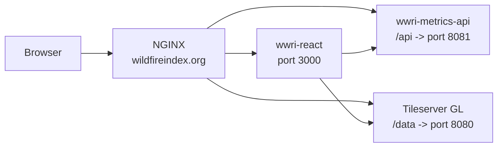

# WWRI React Frontend

This repository contains the React/Vite frontend for the Wildfire Resilience Index website.

Production site:

```text
https://wildfireindex.org
```

The production deployment has three moving parts:

- `wwri-react`: static frontend build served on port `3000`
- `wwri-metrics-api`: backend metrics API served on port `8081`
- `wwri-tileserver`: Tileserver GL Docker container served on port `8080`

NGINX routes public traffic from `wildfireindex.org` to those services.



## Local Development

### Install

```bash
npm install
```

Serve with hot reload at <http://localhost:5173>.

```bash
npm run dev
```

By default, local development uses the deployed preview services for API and tile requests. Service URL behavior is configured in:

```text
src/config/api.ts
```

The frontend does not require environment variables for normal local development or production deployment. Optional local-only overrides can be placed in `.env.local` if needed:

```bash
VITE_API_BASE_URL=http://localhost:8081
VITE_TILE_SERVER_URL=http://localhost:8080
VITE_FORCE_PRODUCTION_TILES=true
VITE_LOCAL_TILES=true
VITE_ENABLE_DEVTOOLS=true
```

These variables are optional. The production build normally uses same-origin `/api` and `window.location.origin` tile URLs through NGINX.

## Checks

Typecheck:

```bash
npm run typecheck
```

Lint:

```bash
npm run lint
```

Test:

```bash
npm run test
```

Build:

```bash
npm run build
```

Preview the production build locally:

```bash
npm run serve
```

## Production Deployment

Production files live on `major-sculpin` at:

```text
/home/woverbyethompson/wwri-react
```

The `systemd` service serves the built `dist` directory:

```bash
sudo systemctl status wwri-frontend
sudo systemctl restart wwri-frontend
sudo journalctl -u wwri-frontend -f
```

After deploying frontend changes:

```bash
cd /home/woverbyethompson/wwri-react
npm install
npm run build
sudo systemctl restart wwri-frontend
```

Smoke test:

```bash
curl -I https://wildfireindex.org/
```

## API And Tile Integration

The frontend builds metrics API URLs through `src/config/api.ts`.

Production API examples:

```bash
curl https://wildfireindex.org/api/health
curl https://wildfireindex.org/api/us/tract/domains
curl https://wildfireindex.org/api/us/tract/summary
curl https://wildfireindex.org/api/us/tract/region/41025960200
```

Production tile examples:

```bash
curl -I https://wildfireindex.org/data/us_tracts/0/0/0.pbf
curl -I https://wildfireindex.org/data/us_districts/0/0/0.pbf
curl -I https://wildfireindex.org/data/ca_ridings/0/0/0.pbf
curl -I https://wildfireindex.org/data/labels/0/0/0.pbf
```

Use `https://wildfireindex.org`, not `https://major-sculpin.nceas.ucsb.edu`, for HTTPS smoke tests. The active certificate is issued for `wildfireindex.org`.

## License

This project is licensed under the MIT License.
